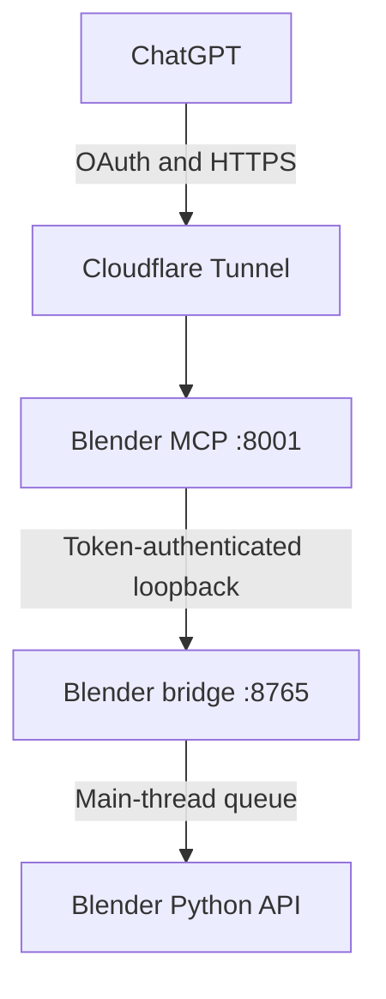

# Local Ubuntu Blender MCP

A secure, OAuth-protected Model Context Protocol server that lets ChatGPT inspect and make constrained changes to Blender running on an Ubuntu desktop.

This is an independent, security-focused implementation inspired by the Local Ubuntu MCP architecture. It is not Blender's official Lab MCP server. In particular, it does not expose arbitrary Python or shell execution.

> [!WARNING]
> This software controls an interactive Blender session. Keep mutations disabled until authentication, bridge isolation, and audit logging have been verified.

## Capabilities

| MCP tool | Default | Purpose |
| --- | --- | --- |
| `blender_health` | Enabled | Check Blender version, current file, and bridge status |
| `blender_get_scene` | Enabled | Read scene, frame, renderer, camera, selection, and object count |
| `blender_list_objects` | Enabled | List up to 200 scene objects and their transforms |
| `blender_get_object` | Enabled | Inspect one named object |
| `blender_turntable_start` | Enabled | Start a 360° viewport capture of a geometry object |
| `blender_turntable_status` | Enabled | Read capture progress and errors |
| `blender_turntable_sheet` | Enabled | Return the completed contact sheet as an MCP image |
| `blender_create_primitive` | Disabled | Create an allowlisted mesh primitive |
| `blender_create_mesh` | Disabled | Create bounded custom topology from vertices, edges, and faces |
| `blender_add_modifier` | Disabled | Add one allowlisted modifier to an existing mesh object |
| `blender_create_collection` | Disabled | Create a collection and move existing scene objects into it |
| `blender_delete_collection` | Disabled | Delete one exact-name collection while preserving its contents |
| `blender_set_transform` | Disabled | Replace one object's location, rotation, and scale |
| `blender_delete_object` | Disabled | Delete one exact-name object from the open Blender file |

Supported primitives are `CUBE`, `UV_SPHERE`, `CYLINDER`, `CONE`, `TORUS`, and `PLANE`. Rotation values are radians.

### 360° viewport preview

With Blender open on a desktop and a 3D View visible, call `blender_turntable_start`
with a geometry object or collection name and `views` of 8, 12 (default), 16, or 24. Poll
`blender_turntable_status(job_id)` until `state` is `completed`, then call
`blender_turntable_sheet(job_id)` to see a labeled PNG contact sheet in the MCP
client. Failed jobs report an error in the status response. Captures expire after
10 minutes; download the sheet before then. Only one capture can run at a time.
The tool rotates the viewport around the selected object's bounding box or the
combined bounds of the collection's geometry objects (including child collections); it
does not rotate or save the model. It restores the original viewport and render
settings after each frame. Other scene objects are hidden temporarily for each
frame so the sheet focuses on the named object or collection. The scene is temporarily blocked from changes by
this bridge while capture is running. Other manual edits in Blender during a
capture may still affect the result, so leave the scene idle until it finishes.

The 3D View must remain open for capture. The bridge serves each 320 px PNG
over its token-authenticated loopback interface; the MCP server assembles them
into one 1280 px wide sheet. Images never go through the bridge JSON response.
This is a turntable around the world's vertical axis, not a full spherical view;
top and bottom views are future extensions. Verify the first capture against
the visible Blender scene in the target VM before relying on the preview.

### Custom topology

`blender_create_mesh(vertices, edges, faces)` creates an object named
`CustomMesh` from zero-based vertex indices. Pass the optional `name` argument
to create a specifically named object. For example:

```python
blender_create_mesh(
    vertices=[[0, 0, 0], [3, 0, 0], [1, 1.5, 0], [0, 1, 0]],
    edges=[],
    faces=[[0, 1, 2, 3]],
    name="Wing",
)
```

Empty edge and face lists are allowed. Each edge needs two distinct indices;
each face needs 3 to 256 distinct indices. The tool accepts at most 4,096
vertices, 8,192 edges, 4,096 faces, and 32,768 face-index references. Coordinates
must be finite and within ±100,000. Duplicate undirected edges, invalid indices,
degenerate topology, and existing object names are rejected before Blender is
changed. The operation requires mutations to be enabled and is blocked during a
turntable capture. Save the `.blend` file in Blender to persist the result.

### Modifiers

`blender_add_modifier(object_name, modifier_type, parameters={})` appends one
non-applied modifier to an existing mesh object in the current scene. Modifier
types and enum values are case-insensitive. For example:

```python
blender_add_modifier(
    object_name="Wing",
    modifier_type="BEVEL",
    parameters={"width": 0.08, "segments": 3, "limit_method": "ANGLE"},
)
```

The first version supports these bounded parameter allowlists:

| Modifier | Supported parameters |
| --- | --- |
| `ARRAY` | `count`, `use_relative_offset`, `relative_offset_displace`, `use_constant_offset`, `constant_offset_displace`, `use_merge_vertices`, `merge_threshold` |
| `BEVEL` | `width`, `segments`, `limit_method`, `angle_limit`, `affect`, `use_clamp_overlap` |
| `BOOLEAN` | `object` (required), `operation`, `solver` |
| `DECIMATE` | `decimate_type`, `ratio`, `iterations`, `angle_limit`, `use_collapse_triangulate` |
| `MIRROR` | `use_axis`, `use_clip`, `use_mirror_merge`, `merge_threshold`, `use_bisect_axis`, `use_bisect_flip_axis`, `mirror_object` |
| `SCREW` | `screw_offset`, `angle`, `steps`, `render_steps`, `iterations`, `axis`, `use_smooth_shade`, `use_merge_vertices`, `merge_threshold` |
| `SIMPLE_DEFORM` | `deform_method`, `deform_axis`, `angle`, `factor`, `limits`, `lock_x`, `lock_y`, `lock_z` |
| `SOLIDIFY` | `thickness`, `offset`, `use_even_offset`, `use_quality_normals` |
| `SUBSURF` | `levels`, `render_levels`, `subdivision_type`, `use_limit_surface` |
| `TRIANGULATE` | `quad_method`, `ngon_method`, `min_vertices` |

Unknown modifier types and parameter names are rejected rather than passed to
Blender. Numeric values, counts, enum values, axes, vectors, and limits are
bounded. `BOOLEAN.object` and `MIRROR.mirror_object` take exact object names and
must resolve inside the current scene; self-references are rejected. The tool
does not apply the modifier or save the file. It requires mutations to be
enabled and is blocked during turntable capture.

### Collections

For example, `blender_create_collection(name="RobotArm", object_names=["Cube", "RobotArm_Pedestal"])` creates a new scene collection and moves both existing objects into it. The tool accepts 1 to 200 distinct names. It checks every object before changing the scene, rejects an existing collection name, and preserves object links in other scenes. Enable mutations to use it. Save the `.blend` file in Blender to keep the change across sessions.

`blender_delete_collection(name="RobotArm")` deletes the exact-name collection datablock after moving its direct objects and child collections to every location where the collection was linked. Objects and nested collections therefore remain available in the scene. The target must belong to the current scene, mutations must be enabled, and the call is blocked during a turntable capture. Save the `.blend` file only when you intend to persist the change.

### Object deletion

`blender_delete_object(name="Cube")` deletes exactly one object datablock and unlinks it from every collection and scene in the open Blender file. It does not accept wildcards or purge the object's now-unused mesh or other data. The call requires mutations to be enabled and is blocked during a turntable capture. Back up the scene and confirm the exact object name before calling it. Save the `.blend` file only when you intend to persist the deletion.

## Architecture



There are two authentication boundaries:

1. Auth0 protects the public MCP resource with the `blender.control` scope.
2. A separate high-entropy secret protects the loopback bridge between the MCP process and Blender.

The bridge accepts only named, validated operations and binds to `127.0.0.1`. Never publish port `8765` through Cloudflare, a firewall rule, VirtualBox port forwarding, or a router.

## Deployment documentation

Start with [Deployment on Ubuntu Desktop in VirtualBox](docs/DEPLOYMENT_UBUNTU_VIRTUALBOX.md).

| Document | Purpose |
| --- | --- |
| [VirtualBox preparation](docs/VIRTUALBOX.md) | VM sizing, NAT, graphics, snapshots, and Guest Additions |
| [Blender and add-on installation](docs/BLENDER_INSTALLATION.md) | Install Blender and the custom bridge |
| [Auth0 configuration](docs/AUTH0.md) | API, audience, scope, issuer, and login setup |
| [Cloudflare Tunnel](docs/CLOUDFLARE.md) | Add a dedicated hostname to a new or existing named tunnel |
| [Operations](docs/OPERATIONS.md) | Start, stop, update, rotate secrets, and control mutations |
| [Security model](docs/SECURITY.md) | Trust boundaries, controls, and residual risks |
| [Troubleshooting](docs/TROUBLESHOOTING.md) | Common VM, Blender, OAuth, tunnel, and port failures |
| [Acceptance checklist](docs/ACCEPTANCE_CHECKLIST.md) | Evidence required before enabling mutations |
| [Automation status](docs/AUTOMATION_STATUS.md) | Manual steps and deployment scripts still to be implemented |

## Development setup

Requirements:

- Ubuntu Desktop
- Blender 4.2+ at code level; Blender 5.1+ is the initial deployment-validation baseline
- Python 3.11+
- An Auth0 API for the public MCP resource
- A Cloudflare named tunnel for remote ChatGPT access

```bash
git clone https://github.com/Nicolas-C-G/local-ubuntu-blender-mcp.git
cd local-ubuntu-blender-mcp
git checkout feature/blender-mcp-mvp

python3 -m venv .venv
.venv/bin/python -m pip install --upgrade pip
.venv/bin/python -m pip install -e .
.venv/bin/python -m pip install pytest
```

For production-like deployment, do not continue from this abbreviated section; follow the complete deployment guide.

## Tests

```bash
.venv/bin/python -m pytest
```

CI installs the package, compiles the add-on source, and runs the unit tests. A real-Blender integration test inside the target VM is still required before a release is described as deployment-validated.

## Current limitations

- Blender must remain open with the custom add-on enabled.
- Saving, applying modifiers, final camera rendering, materials, undo checkpoints, orphan-data purging, and file export are intentionally deferred.
- Deployment is currently documented as a manual procedure; install and verification shell scripts are not yet present.
- The `.mcpb` bundle mentioned by Blender's official Lab project is not used by this remote OAuth/Cloudflare architecture.

## License

MIT
